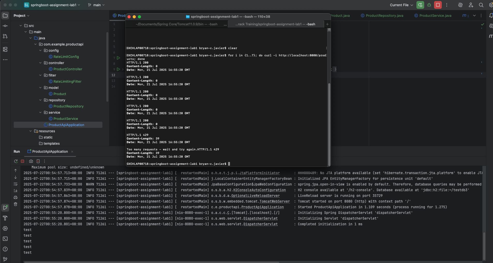
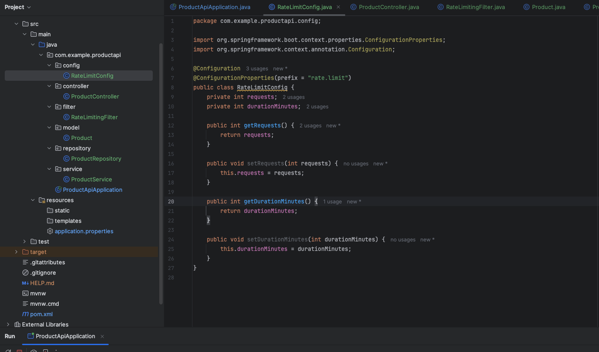
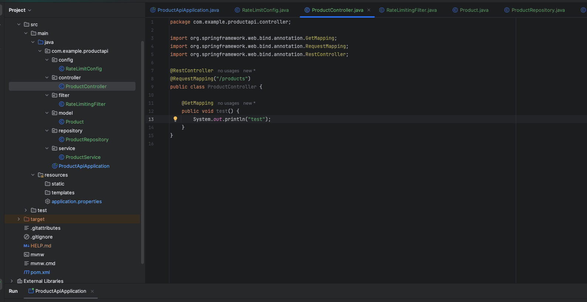
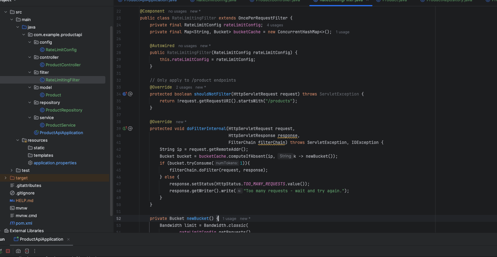
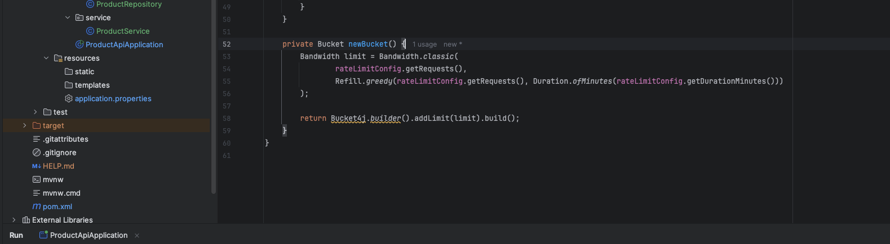
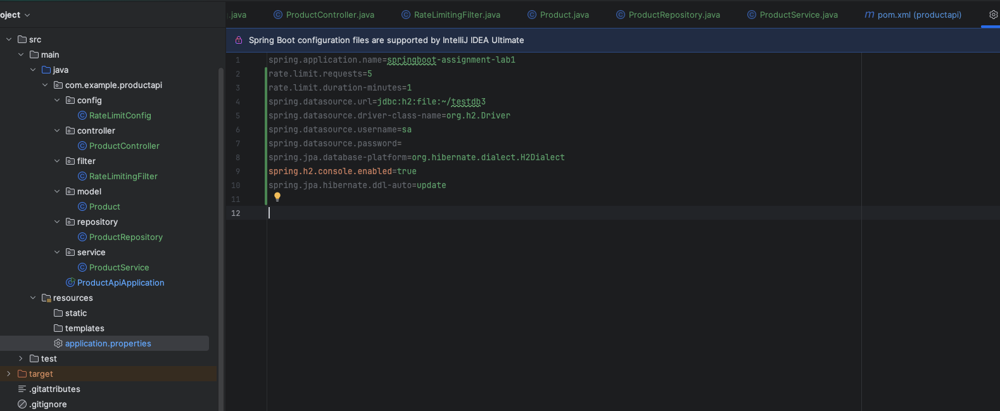

Project Title: Assignment Lab 1 : Add Rate Limiting to a Spring Boot API
 
Submitted By: Bryan Javier
 
<h4>Test Run:</h4>

 
<h4>Rate Limit Config:</h4>

 
<h4>Product Controller:</h4>

 
<h4>Rate Limiting Filter:</h4>

 
<h4>Application Properties:</h4>

